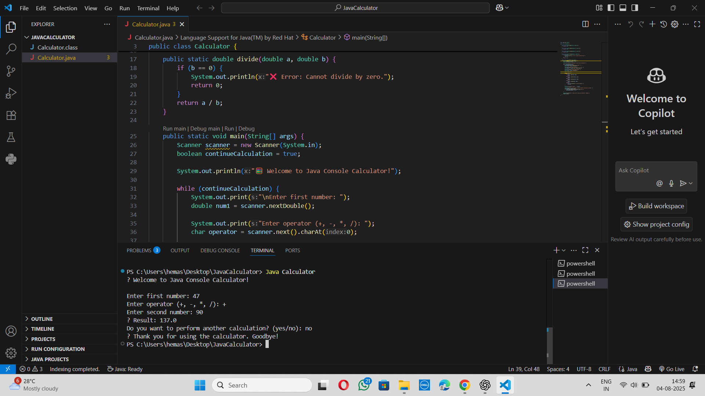

# 🧮 CalcCraft - Java Console Calculator

**CalcCraft** is a simple, beginner-friendly calculator built in **Java** using basic programming concepts such as **loops**, **methods**, and **console input/output**. It allows users to perform fundamental arithmetic operations directly from the terminal.

This project is designed especially for beginners who want to practice and understand how core logic in Java programs works.

---

## ✨ Features

- ➕ Addition  
- ➖ Subtraction  
- ✖️ Multiplication  
- ➗ Division  
- 🔁 Loop-based structure for repeated calculations  
- 📥 User input handled through Java's Scanner  
- ✅ Clean and understandable code for beginners  

---

## 📁 Project Structure

- `CalcCraft.java` → Main file containing all logic and functions.
- Uses:
  - `Scanner` for user input
  - `switch-case` for operation selection
  - Loops for continuous execution until user exits

---

## 🚀 Getting Started

To run this project:

1. Clone the repository:
   ```bash
   git clone https://github.com/pucchalapallieeswaridevi/CalcCraft-JAVA.git
   


👩‍💻 Author
Puchalapalli Eeswaridevi

🔗 GitHub Repo – CalcCraft-JAVA

